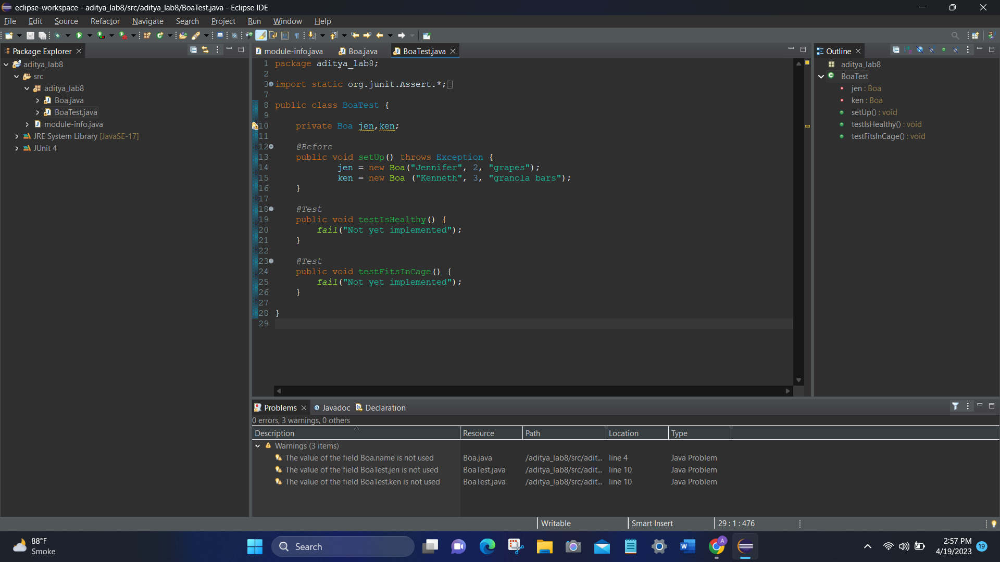

# Lab-8_202001115

Subject: Software Engineering
Subject code: IT314

Lab 8
Date of submission: 19-4-23
Due date of submission: 19-4-23

Name: Aditya Kothari 202001115

Topic: 
Lab Exercises
1,2. 

3.

4.

5.

6.

The test case where cage length is equal to length fails. The code of fitsInCage needs to be fixed. The code should be - 
return this.length <= cageLength;
Updated Code

7.

